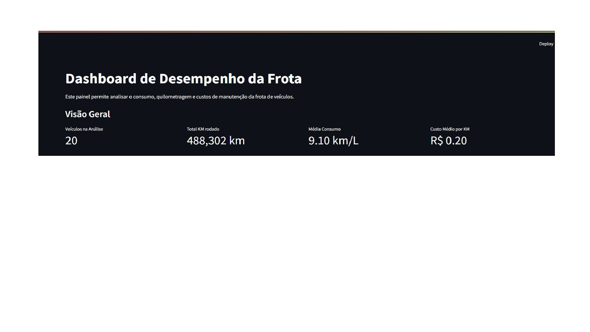
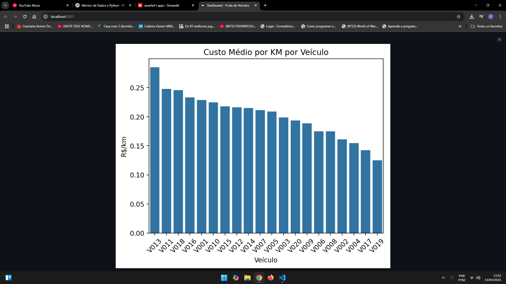

#  Dashboard de Desempenho da Frota de Veículos

Este projeto é um dashboard interativo desenvolvido com **Python + Streamlit**, que permite analisar o desempenho de uma frota de veículos ao longo do tempo.

Você pode visualizar os principais indicadores de uso, consumo e manutenção da frota, com filtros dinâmicos e relatórios exportáveis.

---

##  Tecnologias utilizadas

- Python 3.10+
- Streamlit
- Pandas
- Seaborn / Matplotlib
- ReportLab (para geração de PDF)

---

##  Funcionalidades

- Filtros interativos por **tipo de veículo** e **ID de veículo**
- Indicadores principais:
  - Total de veículos
  - Quilometragem total
  - Consumo médio
  - Custo médio por KM
- Gráficos:
  - KM rodado por mês
  - Consumo médio por veículo
  - Custo médio por KM
- Exportações:
  -  CSV com os dados filtrados
  -  Gráficos em PNG
  -  Relatório em PDF com métricas, gráficos e conclusões automáticas

---

##  Exemplos visuais

### Indicadores principais:



### Gráficos de análise:



---

## Como executar o projeto localmente

Siga os passos abaixo para rodar o dashboard na sua máquina:

```bash
# 1. Clone este repositório
git clone https://github.com/seu-usuario/dashboard-frota-veiculos.git
cd dashboard-frota-veiculos

# 2. Instale as dependências
pip install -r requirements.txt

# 3. Execute a aplicação
streamlit run app.py

Autor
Desenvolvido por Enrique Linhares
Projeto pessoal com foco em análise de dados e visualização interativa.
LinkedIn https://www.linkedin.com/in/enrique-linhares-683728330/
GitHub https://github.com/Azaxhel
